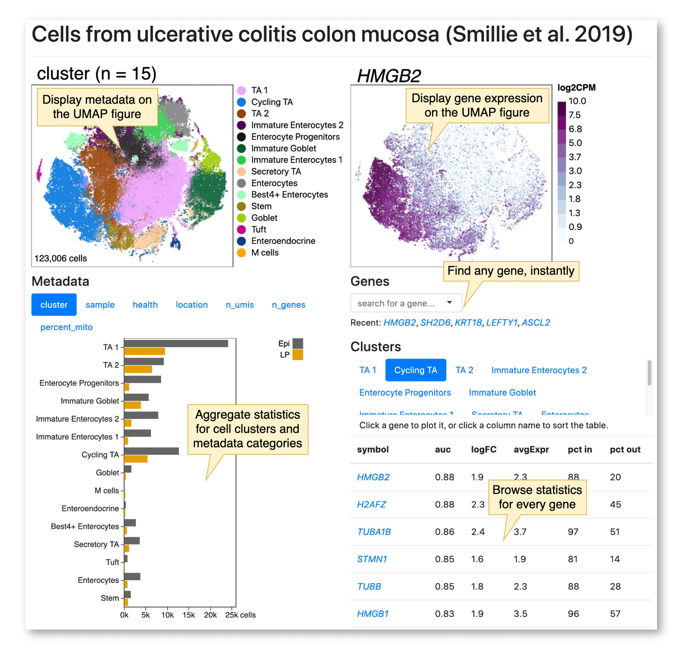

# Cell Guide 🧭 🧙‍♂️ 

**Cell Guide** helps you to navigate large single-cell RNA-seq datasets in your web browser.

This project depends on [Cell Browser] by [Maximilian Haeussler].

[Maximilian Haeussler]: https://github.com/maximilianh


## Overview



## Quick Start

### Step 1. Install Cell Browser

We can quickly install Cell Browser using pip:

[Cell Browser]: https://github.com/maximilianh/cellBrowser

```
pip install cellbrowser
```

Or see [more installation instructions](https://cellbrowser.readthedocs.io/installation.html).

### Step 2. Create a browser for your data

See the [instructions][1] for creating a Cell Browser for your data.

When your browser is working, it should look something like this:

TODO: image of cellBrowser user interface

### Step 3. Copy Cell Guide files

```
TODO
```

[1]: https://cellbrowser.readthedocs.io/basic_usage.html

## How does Cell Guide work?

Cell Guide provides an alternative user interface for Cell Browser.

The reason I chose to write an extension for Cell Browser is because it has these features:

- The user interface is built with static HTML and Javascript files.
- The data is stored in compressed and indexed data files.
- Javascript on the client-side sends range requests to retrieve small pieces of the data files.
